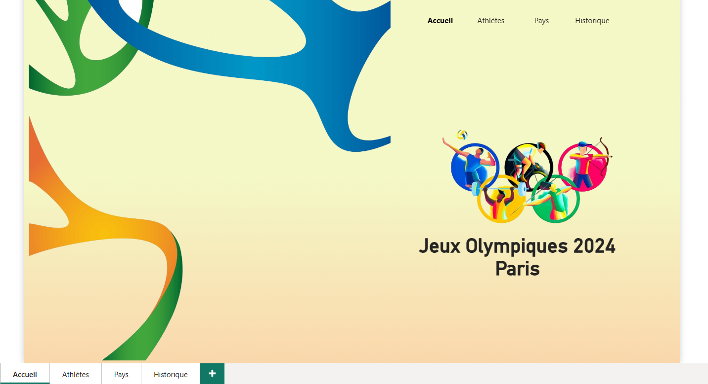
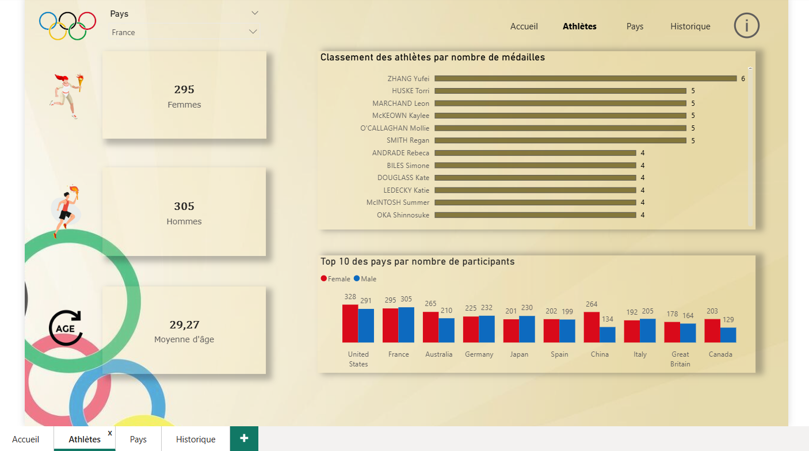
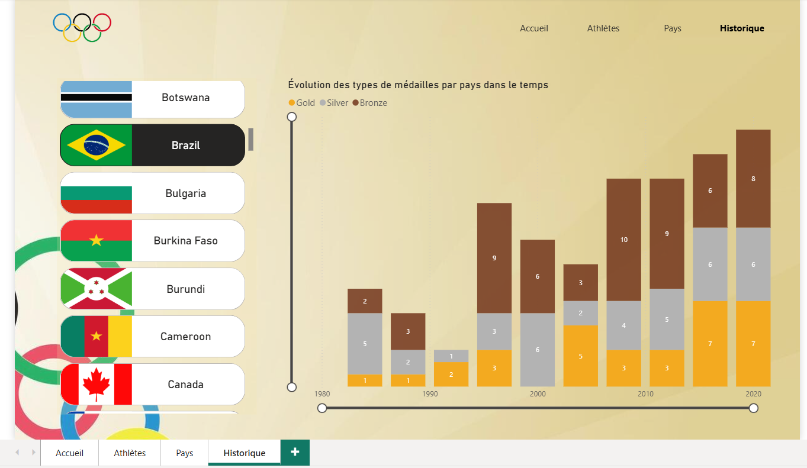

# Analyse des Jeux Olympiques 2024 Paris  – Athlètes, Pays et Médailles

Projet d’analyse des Jeux Olympiques visant à explorer la répartition des athlètes,
des pays et des médailles à travers le temps à l’aide de visualisations interactives
réalisées sous Power BI.

---

## 🏃 Athlètes
Analyse détaillée des athlètes :
- comparaison femmes / hommes par pays (filtre "France" activé sur la capture)
- classement des athlètes par nombre de médailles
- le top 10 des pays par nombre de participants

---

## 🌍 Pays
Cette section permet d’explorer :
- la comparaison des performances par nation

---

## 🎥 Vidéo de démonstration
Présentation de l'utilisation de l'onglet "pays" :

👉 [Voir la vidéo de démonstration](cartev.mp4)

---

## 📈 Historique
Analyse de l’évolution des médailles dans le temps :
- évolution des médailles d’or, d’argent et de bronze par pays
- comparaison temporelle par pays

## 🛠️ Outils utilisés
- Power BI  
- Python (préparation des données)  
- Visualisation de données  
- Analyse exploratoire
