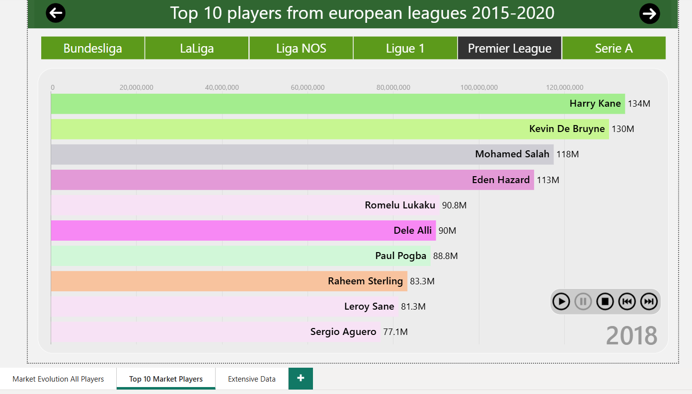
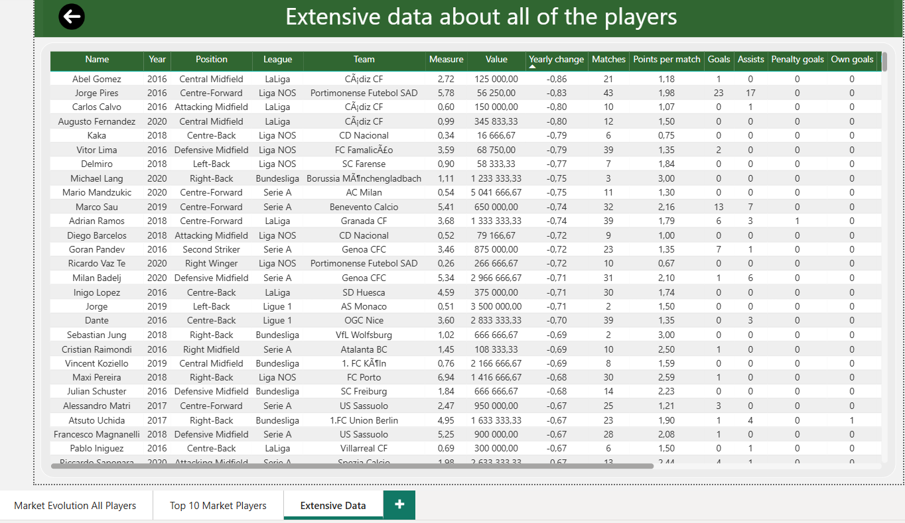

# Évolution de la valeur marchande des joueurs de football

Analyse de l’évolution de la valeur marchande des joueurs à partir de donnéessportives, avec visualisations analytiques.Captures et enregsitrement d'écran pour la démonstration du projet.

---

## Valeur marchande de tous les joueurs (filtré sur Eden Hazard, année 2018)

---

## Top 10 des joueurs avec la plus forte valeur marchande (filtré sur la PL et l'année 2018)

---

## Démonstration vidéo
[Voir la vidéo](Enregistrement_demo.mp4)

---

## Vue globale des données

